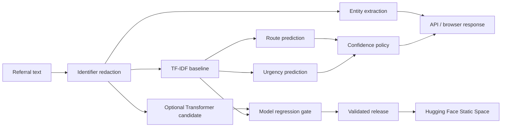

# ClinRoute NLP ReleaseOps

[](https://github.com/singhankitsrf/ClinRoute-NLP-ReleaseOps/actions/workflows/ci.yml) [](https://huggingface.co/spaces/singhankit491/clinroute-nlp)  

**Production-oriented NLP + model-aware CI/CD**

**Reproducible TF-IDF baseline • Optional dual-head Transformer • Entity Extraction • Identifier Redaction • Confidence Routing • FastAPI • Docker • GitHub Actions • CodeQL • Model Regression Gates • Hugging Face deployment**

> Synthetic referral text only. Software/NLP engineering portfolio project; not a clinically validated system.

## Live demonstration

**Hugging Face Space:** https://huggingface.co/spaces/singhankit491/clinroute-nlp

The public free-tier Space runs the validated TF-IDF + logistic-regression models entirely in the browser from exported vocabulary, IDF weights and classifier coefficients. GitHub Actions reproduces the benchmark, enforces the model-regression gate, verifies browser/scikit-learn probability parity, smoke-tests the static bundle and then publishes the exact validated artifact.

The repository also retains the Python/Gradio/Docker implementation as the server-runtime deployment path.

## Architecture



## Why this project is different

The model is treated as a versioned software dependency. Releases can be blocked by data-contract failures, application/security checks, NLP contract regressions, macro-F1 regression, calibration degradation, or browser-runtime parity failures.

## Outputs

- referral pathway: otology, audiology, rhinology, laryngology, general ENT
- urgency: routine, expedited, urgent
- lightweight symptom/finding/duration entities
- best-effort synthetic identifier redaction
- confidence-based `review_required` policy
- reproducible evaluation report, predictions and split provenance
- client-side portable model artifact for the public Hugging Face demo

## Repository structure

```text
src/clinroute/       application and NLP package
training/            baseline and Transformer training
scripts/             contracts, regression gate, portable export and release provenance
hf_space/            Python/Gradio/Docker server deployment
hf_static/           free-tier browser ML Hugging Face deployment
tests/               automated tests
evaluation/          measured benchmark evidence and provenance
docs/                architecture, API, model and security notes
.github/workflows/   CI, CodeQL, model gate, release and Hugging Face deployment
Dockerfile           non-root baseline runtime
Dockerfile.transformer  Transformer runtime
```

## Quick start

```bash
python -m venv .venv
source .venv/bin/activate
pip install -e ".[dev]"
python scripts/generate_synthetic_data.py --rows 3000 --seed 42
python scripts/check_data_contract.py
python training/train_baseline.py
pytest -q
MODEL_DIR=models/baseline uvicorn clinroute.api:app --host 0.0.0.0 --port 8000
```

## Model regression gate

```bash
python scripts/model_regression_gate.py --baseline release/baseline_metrics.json --candidate release/candidate_metrics.json
```

Default tolerances are engineering examples, not clinical acceptance thresholds.

## Reproducible benchmark boundary

The seeded benchmark redacts obvious identifiers and removes identical normalized notes before splitting. The measured synthetic task uses templated text with shared vocabulary and explicitly stated urgency, so high benchmark accuracy demonstrates deterministic pipeline execution rather than clinical or real-world generalization.

## Responsible use

The repository intentionally uses synthetic data. Redaction is not a certified de-identification system, and no model here should be used as a clinical decision-maker without approved data governance, external validation, clinical oversight, and relevant regulatory/organizational review.

## Author

**Ankit Kumar Singh** — Applied AI • NLP • Transformers • MLOps • CI/CD • Healthcare AI • Cloud/Platform Engineering

## Hugging Face deployment and evaluation

The live public deployment is the free Static Space at https://huggingface.co/spaces/singhankit491/clinroute-nlp. The `hf_static/` bundle is generated from trained scikit-learn parameters and validated against Python inference before publication. The `hf_space/` directory retains the Gradio/Docker server-runtime implementation. See [deployment instructions](docs/HUGGING_FACE.md) and the `evaluation/` directory for measured evidence and limitations.

## Project management

- **Project charter:** [`PROJECT.md`](PROJECT.md)
- **Live execution roadmap:** [Project Roadmap #4](https://github.com/singhankitsrf/ClinRoute-NLP-ReleaseOps/issues/4)
- **Portfolio index:** [Five flagship GitHub projects](https://github.com/singhankitsrf/AgentForge-Enterprise-Agentic-RAG/blob/main/PORTFOLIO_PROJECTS.md)
