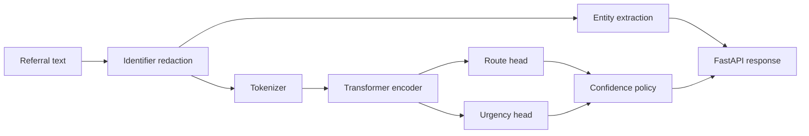

# ClinRoute NLP ReleaseOps

[](https://github.com/singhankitsrf/ClinRoute-NLP-ReleaseOps/actions/workflows/ci.yml)  

**Production NLP + model-aware CI/CD**

**Dual-head Transformers • Entity Extraction • Identifier Redaction • Confidence Routing • FastAPI • Docker • GitHub Actions • CodeQL • Model Regression Gates • GHCR**

> Synthetic referral text only. Software/NLP engineering portfolio project; not a clinically validated system.

## Architecture



## Why this project is different

The model is treated as a versioned software dependency. Releases can be blocked by data-contract failures, application/security checks, NLP contract regressions, macro-F1 regression, or calibration degradation.

## Outputs

- referral pathway: otology, audiology, rhinology, laryngology, general ENT
- urgency: routine, expedited, urgent
- lightweight symptom/finding/duration entities
- best-effort synthetic identifier redaction
- confidence-based `review_required` policy

## Repository structure

```text
src/clinroute/       application and NLP package
training/            baseline and Transformer training
scripts/             contracts, regression gate, release provenance
tests/               automated tests
docs/                architecture, API, model and security notes
.github/workflows/   CI, CodeQL, model gate and release
Dockerfile           non-root baseline runtime
Dockerfile.transformer  Transformer runtime
```

## Quick start

```bash
python -m venv .venv
source .venv/bin/activate
pip install -e ".[dev]"
python scripts/generate_synthetic_data.py --rows 3000 --seed 42
python scripts/check_data_contract.py
python training/train_baseline.py
pytest -q
MODEL_DIR=models/baseline uvicorn clinroute.api:app --host 0.0.0.0 --port 8000
```

## Model regression gate

```bash
python scripts/model_regression_gate.py --baseline release/baseline_metrics.json --candidate release/candidate_metrics.json
```

Default tolerances are engineering examples, not clinical acceptance thresholds.

## Responsible use

The repository intentionally uses synthetic data. Redaction is not a certified de-identification system, and no model here should be used as a clinical decision-maker without approved data governance, external validation, clinical oversight, and relevant regulatory/organizational review.

## Author

**Ankit Kumar Singh** — Applied AI • NLP • Transformers • MLOps • CI/CD • Healthcare AI • Cloud/Platform Engineering
