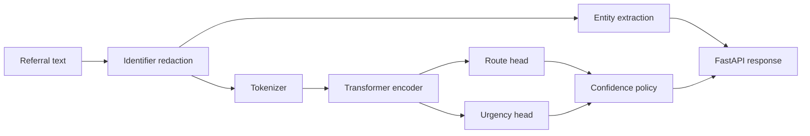
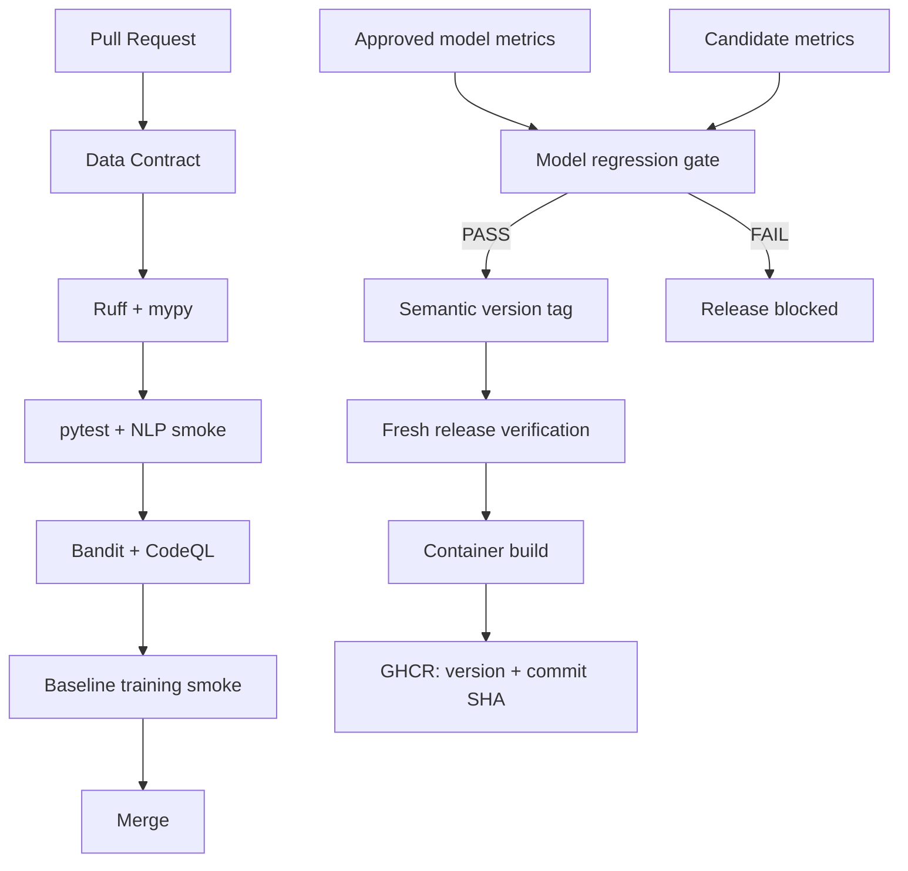

# ClinRoute NLP ReleaseOps

**Production NLP + model-aware CI/CD**

**Dual-head Transformers • Entity Extraction • Identifier Redaction • Confidence Routing • FastAPI • Docker • GitHub Actions • CodeQL • Model Regression Gates • GHCR**

> This repository uses **synthetic referral text only**. It is a software/NLP
> engineering portfolio project, not a clinically validated system.

---

## Why this project is different

A typical NLP portfolio repo shows a notebook and an F1 score.

**ClinRoute NLP ReleaseOps treats the model as a versioned software dependency.**

A release can be blocked because:

- a data contract fails;
- application tests fail;
- static/security checks fail;
- the NLP smoke contract fails;
- a candidate model's macro F1 regresses;
- calibration degrades beyond the release tolerance.

That makes the repository useful for demonstrating both **NLP engineering** and
**CI/CD / MLOps engineering**.

---

## What the system does

Given a synthetic ENT referral note, the platform produces:

1. **Referral pathway**
   - otology
   - audiology
   - rhinology
   - laryngology
   - general ENT

2. **Operational urgency**
   - routine
   - expedited
   - urgent

3. **Lightweight entity extraction**
   - symptoms
   - findings
   - durations

4. **Best-effort identifier redaction**
   - email
   - phone
   - synthetic MRN patterns

5. **Human-review policy**
   - low-confidence predictions return `review_required=true`

---

## NLP architecture



The advanced model is a **multi-task dual-head Transformer**: a shared encoder
feeds separate route and urgency classifiers.

The repository also includes a fast TF-IDF + Logistic Regression baseline so the
full software pipeline can be exercised quickly without a GPU.

---

## CI/CD architecture



---

# Synthetic dataset

The repository includes **3,000 generated synthetic referral notes**.

No real patient text is used.

Labels:

| Task | Labels |
|---|---|
| Route | otology, audiology, rhinology, laryngology, general_ent |
| Urgency | routine, expedited, urgent |

The data generator intentionally inserts fake `.test` emails, synthetic phone
patterns and `SYN-*` identifiers so the redaction layer can be exercised.

**Do not interpret performance on this synthetic dataset as clinical evidence.**

---

# Repository structure

```text
clinroute-nlp-releaseops/
├── src/clinroute/
│   ├── api.py
│   ├── baseline.py
│   ├── calibration.py
│   ├── entities.py
│   ├── policy.py
│   ├── redaction.py
│   ├── schemas.py
│   ├── service.py
│   └── transformer_model.py
├── training/
│   ├── train_baseline.py
│   └── train_transformer.py
├── scripts/
│   ├── check_data_contract.py
│   ├── model_regression_gate.py
│   └── api_contract_smoke.py
├── tests/
├── data/
├── docs/
├── .github/workflows/
│   ├── ci.yml
│   ├── model-gate.yml
│   ├── release.yml
│   └── codeql.yml
├── .github/dependabot.yml
├── Dockerfile
├── docker-compose.yml
├── Makefile
└── pyproject.toml
```

---

# Quick start

## 1. Environment

```bash
python -m venv .venv
```

Windows:

```powershell
.venv\Scripts\Activate.ps1
```

Linux/macOS:

```bash
source .venv/bin/activate
```

Install:

```bash
python -m pip install --upgrade pip
pip install -e ".[dev]"
```

## 2. Validate the repository

```bash
python scripts/check_data_contract.py
ruff check .
mypy src
pytest -q
python scripts/api_contract_smoke.py
```

## 3. Train the fast baseline

```bash
python training/train_baseline.py
```

This creates local model artifacts under:

```text
models/baseline/
```

and synthetic benchmark metrics under:

```text
artifacts/baseline_metrics.json
```

These directories are intentionally excluded from Git.

## 4. Run the API

```bash
MODEL_DIR=models/baseline uvicorn clinroute.api:app --host 0.0.0.0 --port 8000
```

Windows PowerShell:

```powershell
$env:MODEL_DIR="models/baseline"
uvicorn clinroute.api:app --host 0.0.0.0 --port 8000
```

Open:

```text
http://localhost:8000/docs
```

Example request:

```bash
curl -X POST http://localhost:8000/analyze \
  -H "content-type: application/json" \
  -d '{
    "text": "Persistent ear pain for 2 weeks. Contact demo.person@example.test. Urgent review requested."
  }'
```

---

# Train the Transformer candidate

Install the transformer extras:

```bash
pip install -e ".[transformer]"
```

Train:

```bash
python training/train_transformer.py \
  --encoder distilroberta-base \
  --epochs 4 \
  --batch-size 16
```

The advanced architecture uses:

- shared Transformer encoder;
- route classification head;
- urgency classification head;
- joint cross-entropy loss;
- gradient clipping;
- validation macro F1.

For a serious external-data experiment, replace the synthetic corpus with an
approved, de-identified, legally usable dataset and retain the same CI/CD
controls.

---

# Model regression as a release gate

A high-quality NLP platform should not ship a candidate merely because the
training job completed.

The included gate compares candidate versus approved metrics:

```bash
python scripts/model_regression_gate.py \
  --baseline release/baseline_metrics.json \
  --candidate release/candidate_metrics.json
```

Default example policy:

- macro F1 regression tolerance: **0.01**
- ECE degradation tolerance: **0.02**

A failure returns a non-zero exit code and therefore blocks CI/CD.

These values are engineering examples, not clinical acceptance thresholds.

---

# Docker

Build:

```bash
docker build -t clinroute-nlp-releaseops:local .
```

Run after a baseline model exists:

```bash
docker run --rm -p 8000:8000 \
  -v "$(pwd)/models:/models:ro" \
  -e MODEL_DIR=/models/baseline \
  clinroute-nlp-releaseops:local
```

Or:

```bash
docker compose up --build
```

The runtime container uses a non-root user.

---

# GitHub Actions

## CI — every PR / main push

- Python 3.11 + 3.12
- data-contract validation
- Ruff
- mypy
- pytest
- NLP contract smoke test
- Bandit
- reproducible baseline training smoke

## Security

- CodeQL on pushes and pull requests
- scheduled weekly CodeQL scan
- Dependabot for pip, Actions and Docker

## Model gate

A manually triggered workflow can compare a candidate metric artifact against
the currently approved baseline.

## Release

Push a semantic version tag:

```bash
git tag v0.1.0
git push origin v0.1.0
```

After verification, GitHub Actions publishes immutable images to GHCR:

```text
ghcr.io/<owner>/<repo>:v0.1.0
ghcr.io/<owner>/<repo>:<git-sha>
```

That gives both human-readable release versions and precise rollback provenance.

---

# Why this repository matters for senior roles

| Senior capability | Evidence |
|---|---|
| NLP | dual-head Transformer |
| Multi-task learning | shared encoder + two task heads |
| Classical ML | TF-IDF / Logistic Regression baseline |
| NLP preprocessing | redaction + entity extraction |
| Responsible AI | confidence-based review |
| Model evaluation | macro F1 + calibration |
| MLOps | candidate-vs-baseline release gate |
| CI | lint, types, tests, data contract |
| Security | Bandit, CodeQL, Dependabot |
| CD | version-tagged GHCR publishing |
| Release engineering | semantic + immutable SHA tags |
| API engineering | FastAPI + OpenAPI |
| Containers | non-root Docker runtime |
| Data governance mindset | synthetic-only repository dataset |

---

# Recruiter-ready summary

> **ClinRoute NLP ReleaseOps** is a production-oriented NLP platform combining a
> dual-head Transformer for multi-task referral routing and urgency prediction
> with entity extraction, identifier redaction, confidence-based human review,
> model-regression gates and a security-aware GitHub Actions CI/CD pipeline.
> Semantic releases publish immutable container images to GitHub Container
> Registry for traceable deployment and rollback.

---

# Important responsible-use statement

The repository intentionally uses synthetic data.

The redaction component is **not a certified de-identification system**, and the
model is **not clinically validated**. Real clinical deployment would require
approved data governance, privacy controls, external validation, subgroup
analysis, clinical oversight and relevant regulatory/organizational review.

---

## Author

**Ankit Kumar Singh**

Applied AI • NLP • Transformers • MLOps • CI/CD • Healthcare AI • Cloud/Platform Engineering

---

## Re-generate the synthetic corpus

The dataset is reproducible from source:

```bash
python scripts/generate_synthetic_data.py --rows 3000 --seed 42
python scripts/check_data_contract.py
```

## Transformer runtime image

After a real Transformer candidate has been trained into `models/transformer/`,
build the advanced runtime with:

```bash
docker build -f Dockerfile.transformer -t clinroute-transformer:local .
```

The default release workflow deliberately packages the inexpensive synthetic
baseline so CI/CD can execute on ordinary GitHub-hosted runners. The advanced
Transformer path is kept as a separately deployable candidate to avoid turning
every pull request into a GPU training job.
