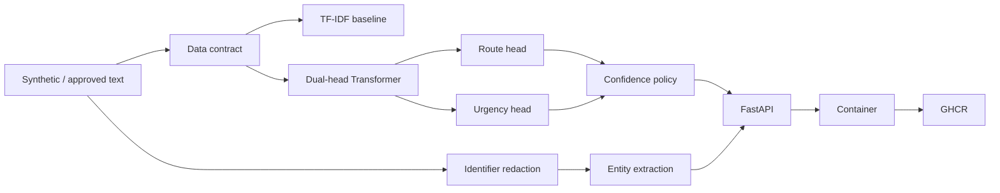

# Architecture

```mermaid
flowchart LR
 A[Synthetic / approved text] --> B[Data contract]
 B --> C[TF-IDF baseline]
 B --> D[Dual-head Transformer]
 D --> E[Route head]
 D --> F[Urgency head]
 E --> G[Confidence policy]
 F --> G
 A --> H[Identifier redaction]
 H --> I[Entity extraction]
 G --> J[FastAPI]
 I --> J
 J --> K[Container]
 K --> L[GHCR]
```

Model quality is treated as a release dependency: candidate metrics can block release even when application tests pass.
